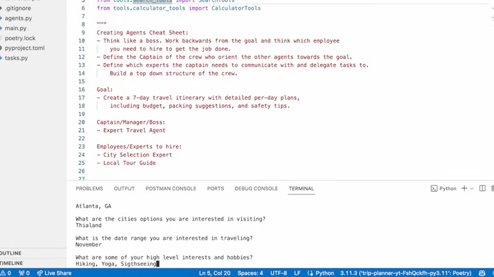
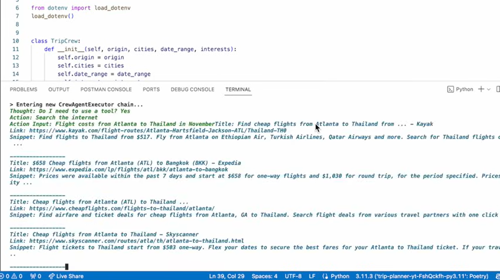
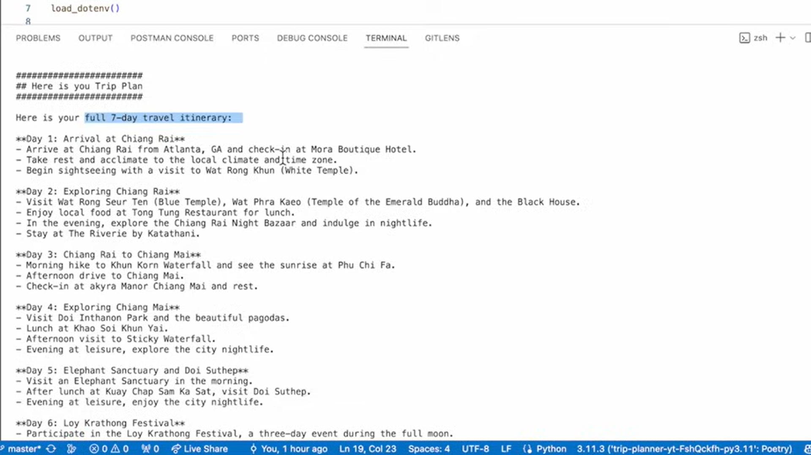

# CrewAI-AI-Trip-Planner

**CrewAI-AI-Trip-Planner** is an AI-powered solution designed to help users efficiently plan their trips. The AI agent interacts with users to recommend destinations, optimize routes, and create itineraries based on preferences. The project integrates **OpenAI** for natural language interaction, **LangChain** for advanced conversation flows, and OpenAI APIs to provide dynamic, real-time trip planning capabilities.

## Key Features

- **AI-Powered Recommendations**: Get personalized suggestions based on preferences, weather, and other factors.
- **Itinerary Planning**: Automatic itinerary creation with flexibility for user customizations.
- **Customizable Agents**: Use OpenAI to build custom trip planners.

## Screenshots

### Providing details about the trip

### All Ai agents communicating with each Other

### Generate Trip according to the inputed Details

## Tech Stack
- **APIs**: OpenAI API, Google Maps API, LangChain, crewAI
- **Database**: MongoDB (optional)

## Setup Instructions

1.Clone the repo:
   git clone https://github.com/OfficialTanishGupta/CrewAI-AI-Trip-Planner.git
   cd CrewAI-AI-Trip-Planner
   
2.Configure environment variables in .env for API keys (OpenAI,Serper).

3.Run the project:
   poetry shell
   pyhton main.py

5.Contributions
   Contributions are welcome! Please submit a pull request or open an issue.

6.License
   This project is licensed under the MIT License.
